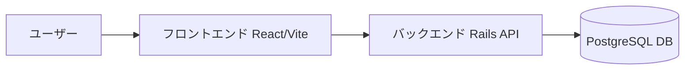

# PostGenerator

PostGeneratorは、React（Vite）とRails APIを組み合わせたWebアプリケーションで、Dockerを使用して開発環境を簡単に構築できます。ユーザーが入力したURLをもとに、スクレイピング登録を行う機能を提供します。

---

## 🚀 特徴

* React（Vite）による高速なフロントエンド
* Rails 8 APIによるバックエンド
* PostgreSQL 15を使用したデータベース
* DockerとDocker Composeによる簡単な開発環境構築
* 複数のURLを一度に登録可能
* スクレイピング登録の成功時に投稿IDを取得し、詳細ページへ遷移可能

---

## 🛠 技術スタック

* フロントエンド: React + Vite
* バックエンド: Rails 8 API
* データベース: PostgreSQL 15
* コンテナ管理: Docker, Docker Compose

---

## ⚙️ 必要な前提ツール

このプロジェクトを動かすには以下のツールを事前にインストールしてください。

- [Git](https://git-scm.com/)  
- [Docker Desktop](https://www.docker.com/products/docker-desktop/)（Docker + Docker Compose を含む）  
- [Node.js](https://nodejs.org/)（フロントエンド開発で直接使う場合）  
- [Rails CLI](https://rubyonrails.org/)（バックエンド開発で直接使う場合）  

※ 通常の利用は **Docker** だけで完結します。Node.js / Rails CLI は開発効率を上げたい場合のみ必要です。

---

## 📂 プロジェクト構造と主要ファイル

### ディレクトリ構造

```
project-root/
├── README.md                     # このファイル
├── docker-compose.yml            # Docker Compose設定
├── backend.Dockerfile            # Rails API用Dockerfile
├── web.Dockerfile                # React Web用Dockerfile
├── entrypoint.sh                 # エントリーポイントスクリプト
├── api/                          # Rails APIアプリケーション
│   ├── app/
│   │   ├── controllers/
│   │   │   ├── posts_controller.rb    # **主要: 投稿管理コントローラー**
│   │   │   ├── scrapes_controller.rb  # **主要: スクレイピングコントローラー**
│   │   │   └── api/
│   │   │       └── details_controller.rb
│   │   ├── models/
│   │   │   ├── post.rb                # **主要: Postモデル**
│   │   │   └── detail.rb              # **主要: Detailモデル**
│   │   ├── services/
│   │   │   └── scrape_service.rb      # **主要: スクレイピングサービス**
│   │   └── views/
│   ├── config/
│   │   ├── routes.rb               # APIルーティング設定
│   │   └── database.yml            # DB設定
│   ├── db/
│   │   └── migrate/                # DBマイグレーション
│   └── Gemfile                     # Ruby依存関係
├── web/                          # React Webアプリケーション
│   ├── src/
│   │   ├── App.jsx                 # **主要: メインアプリコンポーネント**
│   │   ├── pages/
│   │   │   ├── UrlInputPage.jsx     # **主要: URL入力ページ**
│   │   │   ├── PostsListPage.jsx    # **主要: 投稿一覧ページ**
│   │   │   └── PostDetailPage.jsx   # **主要: 投稿詳細ページ**
│   │   └── components/
│   │       ├── Header.jsx           # ヘッダーコンポーネント
│   │       └── CopyButton.jsx       # コピーボタンコンポーネント
│   ├── package.json               # Node.js依存関係
│   └── vite.config.js             # Vite設定
└── src/utils/                    # ユーティリティ（未使用？）
```

### 主要ファイルの役割と内容

#### API側

##### api/app/controllers/posts_controller.rb
投稿のCRUD操作とスクレイピング登録を行うコントローラー。

```ruby
class PostsController < ApplicationController
  rescue_from StandardError, with: :render_error

  # 投稿一覧
  def index
    posts = Post.select(:id, :title, :published_at, :created_at).order(created_at: :asc)
    render json: posts
  end

  # スクレイピング登録
  def scrape
    urls = params[:urls] || []
    date = params[:date] # YYYY-MM-DD

    post_ids = []

    urls.each_with_index do |url, index|
      begin
        post = ScrapeService.new(url, date).call(index)
        post_ids << post.id
      rescue => e
        Rails.logger.error "Scrape failed for #{url}: #{e.message}"
      end
    end

    render json: { status: 'ok', post_ids: post_ids }
  end

  # 投稿詳細
  def show
    post = Post.includes(:details).find_by(id: params[:id])
    if post
      render json: {
        id: post.id,
        title: post.title,
        published_at: post.published_at,
        created_at: post.created_at,
        details: post.details.order(:id).map { |d|
          { id: d.id, date: d.date, content: d.content }
        }
      }
    else
      render json: { status: 'error', message: '投稿が見つかりません' }, status: 404
    end
  rescue => e
    render json: { status: 'error', message: e.message }, status: 500
  end

  # 投稿削除
  def destroy
    post = Post.find(params[:id])
    post.destroy
    render json: { status: 'deleted' }
  end

  private

  def render_error(e)
    render json: { status: 'error', message: e.message }, status: 500
  end
end
```

##### api/app/controllers/scrapes_controller.rb
複数URLのスクレイピング処理を行うコントローラー。

##### api/app/controllers/api/details_controller.rb
詳細関連のAPIコントローラー。

##### api/app/models/post.rb
Postモデル。タイトル必須、detailsと1対多の関係。

```ruby
class Post < ApplicationRecord
    has_many :details, dependent: :destroy
    validates :title, presence: true
end
```

##### api/app/models/detail.rb
Detailモデル。Postに属する。

```ruby
class Detail < ApplicationRecord
  belongs_to :post
end
```

##### api/app/services/scrape_service.rb
URLスクレイピングとデータ作成ロジック。

##### api/config/routes.rb
APIルーティング設定。

##### api/Gemfile
Ruby依存関係。

#### Web側

##### web/src/App.jsx
ルーティングとアプリ構造。

```jsx
import { Route, BrowserRouter as Router, Routes, } from 'react-router-dom'
import UrlInputPage from './pages/UrlInputPage'
import PostsListPage from './pages/PostsListPage'
import PostDetailPage from './pages/PostDetailPage'
import { Toaster } from 'react-hot-toast';
import NotFoundPage from './pages/NotFoundPage'
import Header from './components/Header'

export default function App() {
  return (
    <div className="min-h-screen bg-gray-50 pt-16">
      <Router>
        <Header />
        <Routes>
          <Route path='/' element={<UrlInputPage />} />
          <Route path='/posts' element={<PostsListPage />} />
          <Route path='/posts/:id' element={<PostDetailPage />} />
          <Route path='*' element={<NotFoundPage />} />
        </Routes>
      </Router>
      <Toaster position='top-right' />
    </div>
  );
}
```

##### web/src/pages/UrlInputPage.jsx
ユーザー入力とAPI呼び出し。

##### web/src/pages/PostsListPage.jsx
投稿一覧表示と管理。

##### web/src/pages/PostDetailPage.jsx
投稿詳細とコピー機能。

##### web/src/pages/NotFoundPage.jsx
404ページ。

##### web/src/components/Header.jsx
ヘッダーコンポーネント。

##### web/src/components/CopyButton.jsx
コピーボタンコンポーネント。

##### web/package.json
Node.js依存関係。

##### web/tailwind.config.js
Tailwind CSS設定。

##### web/postcss.config.js
PostCSS設定。

---

## 📦 セットアップ手順

### 1. リポジトリをクローン

サブモジュールも含めて取得する場合は `--recurse-submodules` を使用してください。

```bash
git clone --recurse-submodules https://github.com/Mimic52006masaki/PostGenerator.git
cd PostGenerator
```

既にクローン済みの場合は以下でサブモジュールを初期化・更新します。

```bash
git submodule init
git submodule update
```

### 2. Docker Composeでコンテナをビルド・起動

```bash
docker-compose up --build
```

* backend (Rails API) → [http://localhost:3000](http://localhost:3000)  
* web (React + Vite) → [http://localhost:5173](http://localhost:5173)  
* db (PostgreSQL)

### 3. データベースマイグレーション

```bash
docker-compose exec backend bin/rails db:migrate
```

---

## 🧪 使用方法

1. フロントエンドのテキストエリアに、1行に1つずつURLを入力します。
2. 「登録」ボタンをクリックすると、バックエンドAPIにPOSTリクエストが送信されます。
3. スクレイピング登録が成功すると、成功メッセージとともに投稿IDが表示されます。
4. 投稿IDをクリックすると、詳細ページへ遷移します。

### 投稿の確認

* 投稿一覧: `/posts`
* 投稿詳細: `/posts/:id`

---

## 🔄 開発フロー

### バックエンド（Rails）

* モデル生成: `bin/rails generate model ...`
* マイグレーション: `bin/rails db:migrate`
* APIルート追加: `config/routes.rb`

### フロントエンド（React）

* ページ追加: `web/src/pages/` にファイル作成
* ルーティング設定: `react-router-dom` を編集

### 再ビルド

```bash
docker-compose up --build
```

### データ永続化

* データは `db-data` ボリュームに保持されます
* 完全リセットしたい場合：

```bash
docker-compose down -v
```

💡 開発中にフロントだけリロードしたいとき：

```bash
docker-compose exec web npm run dev
```

---

## 📂 Git & サブモジュール管理

### サブモジュールを含めてクローン

```bash
git clone --recurse-submodules [リポジトリURL]
```

### 既にクローン済みの場合

```bash
git submodule init
git submodule update
```

### サブモジュールの変更を反映する場合

```bash
# サブモジュール内でコミット
cd web
git add .
git commit -m "変更内容"
git push

# ルートリポジトリでポインタを更新
cd ..
git add web
git commit -m "Update web submodule pointer"
git push
```

---

## 🧹 データの永続化について

Docker Composeで立ち上げた場合、データベースのデータは `db-data` というボリュームに保存されます。  
コンテナを停止・削除してもデータは保持されます。  
ただし、ボリューム自体を削除するとデータも失われるため注意してください。

---

## 🏗️ アーキテクチャ図



---

## 🐳 Dockerコンテナ構成図

```mermaid
graph TD
    subgraph docker-compose
        W[web (React + Vite)]
        B[backend (Rails API)]
        D[(db - PostgreSQL)]
    end
    
    W <--> B
    B <--> D
```

---

## 📝 ライセンス

このプロジェクトは MIT ライセンスのもとで公開されています。詳細は [LICENSE](LICENSE) ファイルをご覧ください。

---

## 📄 主要なファイルの内容

このセクションでは、アプリの主要なファイルの役割と内容を紹介します。

### API (Rails)

#### app/controllers/posts_controller.rb
投稿の管理を行うコントローラー。投稿一覧、スクレイピング登録、詳細表示、削除機能を提供。

```ruby
class PostsController < ApplicationController
  rescue_from StandardError, with: :render_error

  # 投稿一覧
  def index
    posts = Post.select(:id, :title, :published_at, :created_at).order(created_at: :asc)
    render json: posts
  end

  # スクレイピング登録
  def scrape
    urls = params[:urls] || []
    date = params[:date]

    post_ids = []

    urls.each_with_index do |url, index|
      begin
        post = ScrapeService.new(url, date).call(index)
        post_ids << post.id
      rescue => e
        Rails.logger.error "Scrape failed for #{url}: #{e.message}"
      end
    end

    render json: { status: 'ok', post_ids: post_ids }
  end

  # 投稿詳細
  def show
    post = Post.includes(:details).find_by(id: params[:id])
    if post
      render json: {
        id: post.id,
        title: post.title,
        published_at: post.published_at,
        created_at: post.created_at,
        details: post.details.order(:id).map { |d|
          { id: d.id, date: d.date, content: d.content }
        }
      }
    else
      render json: { status: 'error', message: '投稿が見つかりません' }, status: 404
    end
  end

  # 投稿削除
  def destroy
    post = Post.find(params[:id])
    post.destroy
    render json: { status: 'deleted' }
  end

  private

  def render_error(e)
    render json: { status: 'error', message: e.message }, status: 500
  end
end
```

#### app/controllers/scrapes_controller.rb
スクレイピング処理を行うコントローラー。複数のURLを処理し、エラーハンドリングを行う。

#### app/models/post.rb
Postモデル。タイトル必須、詳細と1対多の関係。

```ruby
class Post < ApplicationRecord
    has_many :details, dependent: :destroy
    validates :title, presence: true
end
```

#### app/models/detail.rb
Detailモデル。Postに属する。

```ruby
class Detail < ApplicationRecord
  belongs_to :post
end
```

#### app/services/scrape_service.rb
スクレイピングサービス。URLからHTMLを取得、Nokogiriで解析し、PostとDetailを作成。

```ruby
require 'open-uri'
require 'nokogiri'

class ScrapeService
  TIMES = (7..21).map { |h| "#{h}:00" }

  def initialize(url, date = nil)
    @url = url
    @date = date
  end

  def call(index = 0)
    html = URI.open(@url, read_timeout: 20, open_timeout: 10, 'User-Agent' => 'Mozilla/5.0').read
    doc  = Nokogiri::HTML.parse(html)

    body = doc.at('article.post') || doc
    title_text = body.at('h1.post__title')&.text&.strip.presence || URI.parse(@url).host

    contents = body.css('div.post__content')
    container = contents.first || body

    date_nodes   = container.css('div.t_h')
    detail_nodes = container.css('div.t_b')

    count = [date_nodes.size, detail_nodes.size].min
    time = TIMES[index % TIMES.size]
    published_at = @date.present? ? "#{@date} #{time}" : nil

    post = Post.create!(title: title_text, published_at: published_at)

    count.times do |i|
      raw_text = date_nodes[i]&.text&.strip.to_s
      parts = raw_text.split
      new_date_text = parts.any? ? "#{parts[0]} アニメまとめCH #{parts[-1]}" : ''

      detail_html = detail_nodes[i]&.inner_html.to_s

      wrapped_html = <<~HTML
        <div class="message-container">
          <div class="message">
            <div class="message-content">
              <p>#{detail_html}</p>
            </div>
            <div class="message-timestamp">
              <p>#{new_date_text}</p>
            </div>
          </div>
        </div>
      HTML

      post.details.create!(date: new_date_text, content: wrapped_html)
    end

    post
  rescue OpenURI::HTTPError, SocketError, Timeout::Error => e
    raise StandardError, "fetch failed: #{e.class}: #{e.message}"
  end
end
```

### Web (React)

#### src/App.jsx
メインのアプリコンポーネント。ルーティングを設定。

```jsx
import { Route, BrowserRouter as Router, Routes, } from 'react-router-dom'
import './App.css'
import UrlInputPage from './pages/UrlInputPage'
import PostsListPage from './pages/PostsListPage'
import PostDetailPage from './pages/PostDetailPage'
import { Toaster } from 'react-hot-toast';
import NotFoundPage from './pages/NotFoundPage'
import Header from './components/Header'

export default function App() {
  return (
    <>
      <Router>
        <Header />
        <Routes>
          <Route path='/' element={<UrlInputPage />} />
          <Route path='/posts' element={<PostsListPage />} />
          <Route path='/posts/:id' element={<PostDetailPage />} />
          <Route path='*' element={<NotFoundPage />} />
        </Routes>
      </Router>
      <Toaster position='top-right' />
    </>
  );
}
```

#### src/pages/UrlInputPage.jsx
URL入力ページ。ユーザーがURLと日付を入力し、スクレイピングをトリガー。

#### src/pages/PostsListPage.jsx
投稿一覧ページ。投稿のリストを表示、詳細閲覧や削除可能。

#### src/pages/PostDetailPage.jsx
投稿詳細ページ。投稿の内容を表示、コピー機能を提供。

---

## ✅ コントリビュート方法

1. Issue を立てて議論  
2. ブランチを作成して開発  
3. プルリクエストを送信  

