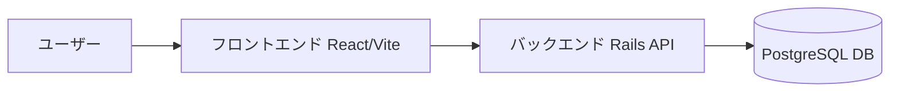

# PostGenerator

PostGeneratorは、React（Vite）とRails APIを組み合わせたWebアプリケーションで、Dockerを使用して開発環境を簡単に構築できます。ユーザーが入力したURLをもとに、スクレイピング登録を行う機能を提供します。

---

## 🚀 特徴

* React（Vite）による高速なフロントエンド
* Rails 8 APIによるバックエンド
* PostgreSQL 15を使用したデータベース
* DockerとDocker Composeによる簡単な開発環境構築
* 複数のURLを一度に登録可能
* スクレイピング登録の成功時に投稿IDを取得し、詳細ページへ遷移可能

---

## 🛠 技術スタック

* フロントエンド: React + Vite
* バックエンド: Rails 8 API
* データベース: PostgreSQL 15
* コンテナ管理: Docker, Docker Compose

---

## ⚙️ 必要な前提ツール

このプロジェクトを動かすには以下のツールを事前にインストールしてください。

- [Git](https://git-scm.com/)  
- [Docker Desktop](https://www.docker.com/products/docker-desktop/)（Docker + Docker Compose を含む）  
- [Node.js](https://nodejs.org/)（フロントエンド開発で直接使う場合）  
- [Rails CLI](https://rubyonrails.org/)（バックエンド開発で直接使う場合）  

※ 通常の利用は **Docker** だけで完結します。Node.js / Rails CLI は開発効率を上げたい場合のみ必要です。

---

## 📦 セットアップ手順

### 1. リポジトリをクローン

サブモジュールも含めて取得する場合は `--recurse-submodules` を使用してください。

```bash
git clone --recurse-submodules https://github.com/Mimic52006masaki/PostGenerator.git
cd PostGenerator
```

既にクローン済みの場合は以下でサブモジュールを初期化・更新します。

```bash
git submodule init
git submodule update
```

### 2. Docker Composeでコンテナをビルド・起動

```bash
docker-compose up --build
```

* backend (Rails API) → [http://localhost:3000](http://localhost:3000)  
* web (React + Vite) → [http://localhost:5173](http://localhost:5173)  
* db (PostgreSQL)

### 3. データベースマイグレーション

```bash
docker-compose exec backend bin/rails db:migrate
```

---

## 🧪 使用方法

1. フロントエンドのテキストエリアに、1行に1つずつURLを入力します。
2. 「登録」ボタンをクリックすると、バックエンドAPIにPOSTリクエストが送信されます。
3. スクレイピング登録が成功すると、成功メッセージとともに投稿IDが表示されます。
4. 投稿IDをクリックすると、詳細ページへ遷移します。

### 投稿の確認

* 投稿一覧: `/posts`
* 投稿詳細: `/posts/:id`

---

## 🔄 開発フロー

### バックエンド（Rails）

* モデル生成: `bin/rails generate model ...`
* マイグレーション: `bin/rails db:migrate`
* APIルート追加: `config/routes.rb`

### フロントエンド（React）

* ページ追加: `web/src/pages/` にファイル作成
* ルーティング設定: `react-router-dom` を編集

### 再ビルド

```bash
docker-compose up --build
```

### データ永続化

* データは `db-data` ボリュームに保持されます
* 完全リセットしたい場合：

```bash
docker-compose down -v
```

💡 開発中にフロントだけリロードしたいとき：

```bash
docker-compose exec web npm run dev
```

---

## 📂 Git & サブモジュール管理

### サブモジュールを含めてクローン

```bash
git clone --recurse-submodules [リポジトリURL]
```

### 既にクローン済みの場合

```bash
git submodule init
git submodule update
```

### サブモジュールの変更を反映する場合

```bash
# サブモジュール内でコミット
cd web
git add .
git commit -m "変更内容"
git push

# ルートリポジトリでポインタを更新
cd ..
git add web
git commit -m "Update web submodule pointer"
git push
```

---

## 🧹 データの永続化について

Docker Composeで立ち上げた場合、データベースのデータは `db-data` というボリュームに保存されます。  
コンテナを停止・削除してもデータは保持されます。  
ただし、ボリューム自体を削除するとデータも失われるため注意してください。

---

## 🏗️ アーキテクチャ図



---

## 🐳 Dockerコンテナ構成図

```mermaid
graph TD
    subgraph docker-compose
        W[web (React + Vite)]
        B[backend (Rails API)]
        D[(db - PostgreSQL)]
    end
    
    W <--> B
    B <--> D
```

---

## 📝 ライセンス

このプロジェクトは MIT ライセンスのもとで公開されています。詳細は [LICENSE](LICENSE) ファイルをご覧ください。

---

## ✅ コントリビュート方法

1. Issue を立てて議論  
2. ブランチを作成して開発  
3. プルリクエストを送信  

